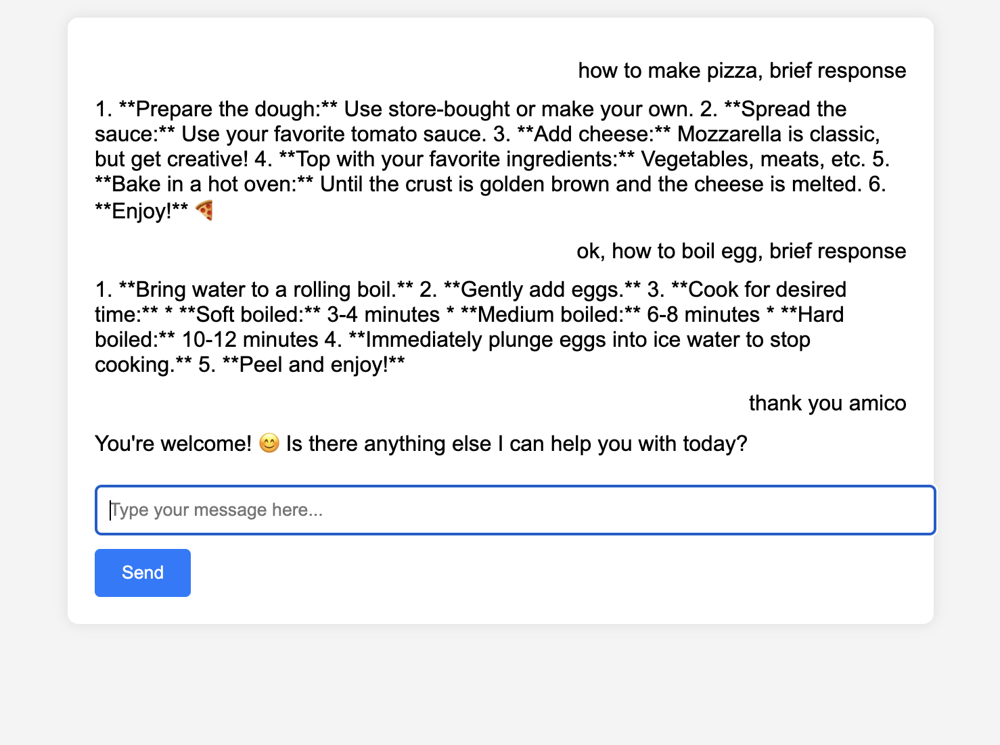

# Flask Chat Application



This repository contains a Flask web application that interacts with a generative AI model using Google Cloud's Vertex AI. The application allows users to input prompts and receive responses from the AI in a chat-like interface.

## Prerequisites

- Python 3.11+
- Google Cloud account
- Docker

## Setup

### Clone the Repository

```sh
git clone https://github.com/yourusername/chatbot-Flask.git
cd chatbot-Flask
```

### Create and Activate Virtual Environment

```sh
python3 -m venv venv
source venv/bin/activate
```

## Rest

### Install Dependencies

Google Cloud Setup

### Create a Service Account in the Google Cloud Console.

Download the JSON key file and set the GOOGLE_APPLICATION_CREDENTIALS environment variable.

```sh
export GOOGLE_APPLICATION_CREDENTIALS="/path/to/your/service-account-file.json"
```

### Build and Run Docker Container

### Deploy to Cloud Run
